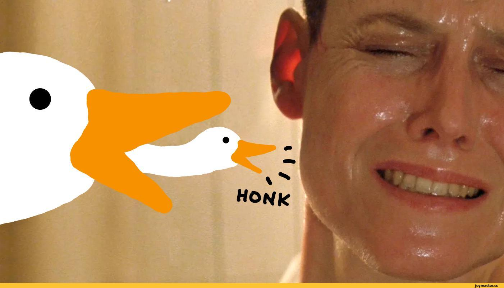

**1**. Умыться
**2**. Помыться
**3**. Позавтракать

## Hello World
** Tested

>  Цитата 1
>> Цитата 2

список
 * проснуться 
 * умыться
 * покушать

 1. проснуться
 2. умыться
 3. покушать
***
{code}
***

[google](https://google.com)

[google][]: https://google.com/

*Line*%**Link**

---

<https://yandex.ru>

new     quest
**1**  делаем  git commit
**2**  делаем git checkout -b "youre branch"
**3**  помещаем свои файлы
**4**  делаем git add.
**5**  делаем git commit 
**6**  делаем git push